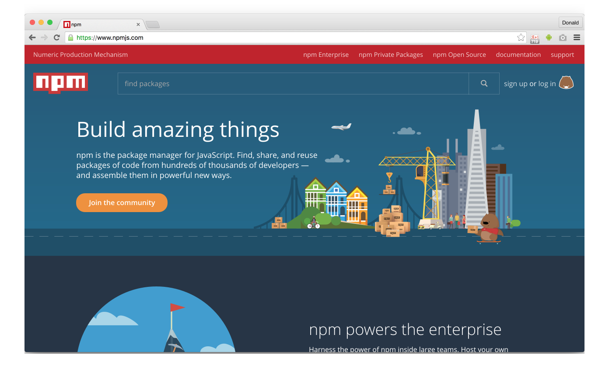
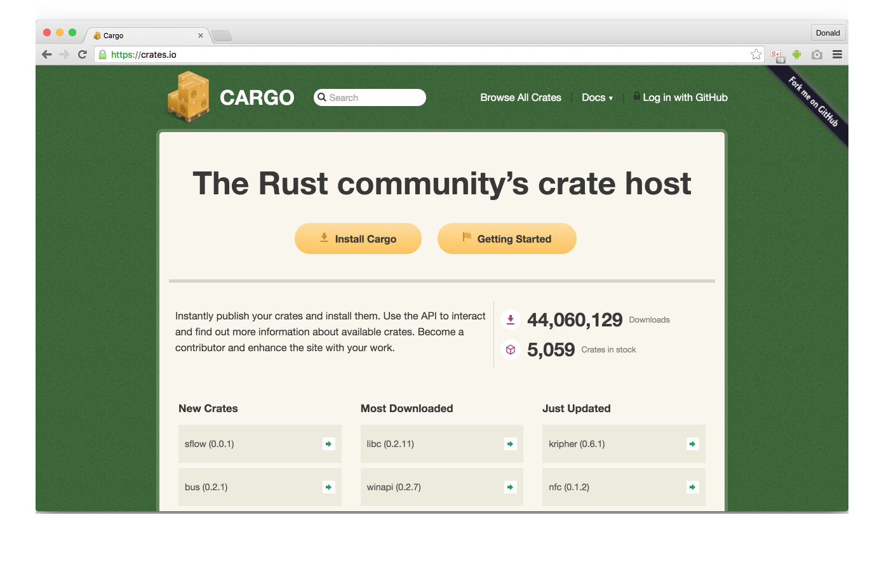

# Package Manager

## Meta Data

Node and Rust both come with a package manager. Nodes package manager is called _npm_, its packages are called _node modules_ and its official website is [npmjs.com](https://www.npmjs.com/). Rusts package manager is called _Cargo_, its packages are called _crates_ and its official website is [creates.io](https://crates.io/).




If you followed my [Setup](../setup) and you use Node v4.4.5 you should update the bundled npm version, because it is relatively old by now. Node v4.4.5 comes with npm v2.15.5, but the current stable version is v3.9.5 at the time of writing this and v3 and v2 differ in a lot of ways. To update npm you just call this:

```bash
$ npm install -g npm
```

And you can verify that the update worked like this:

```bash
$ npm --version
3.9.5
```

As a reminder - I use Rust v1.9.0 and it comes with Cargo v0.10.0-nightly.

```bash
$ cargo --version
cargo 0.10.0-nightly (10ddd7d 2016-04-08)
```

The _manifest file_ - the file which contains meta-data of your project like its name, its version, its dependencies and so on - is called `package.json` in the Node world and `Cargo.toml` in Rust.

Lets have a look at a typical `package.json` without dependencies:

```json
{
  "name": "hello-world",
  "version": "0.1.0",
  "author": "John Doe <john.doe@email.com> (https://github.com/john.doe)",
  "contributors": [
    "Jane Doe <jane.doe@email.com> (https://github.com/jane.doe)"
  ],
  "private": true,
  "description": "This is just a demo.",
  "license": "(MIT OR Apache-2.0)",
  "keywords": [
    "demo",
    "test"
  ],
  "homepage": "https://github.com/john.doe/hello-world",
  "repository": {
    "type": "git",
    "url": "https://github.com/john.doe/hello-world"
  },
  "bugs": "https://github.com/john.doe/hello-world/issues",
  "main": "src/index.js",
  "scripts": {
    "start": "node src"
  }
}
```

The `Cargo.toml` looks really similar (besides being a `.toml` and not `.json`):

```toml
[package]
name = "hello-world"
version = "0.1.0"
authors = ["John Doe <john.doe@email.com>",
           "Jane Doe <jane.doe@email.com>"]
publish = false
description = "This is just a demo."
license = "MIT/Apache-2.0"
keywords = ["demo", "test"]
homepage = "https://github.com/john.doe/hello-world"
repository = "https://github.com/john.doe/hello-world"
documentation = "https://github.com/john.doe/hello-world"
```

So what have we here? Both manifest formats offer `name` and `version` fields which are **mandatory**. Adding the authors of a project is slightly different between the modules, but optional for both. npm assumes a main `author` for every package and multiple `contributors` while in Cargo you just fill an `authors` array. The `authors` field is actually **mandatory** for Cargo. As a value you use a string with the pattern `name <email> (url)` in npm and `name <email>` in Cargo. (Maybe `(url)` will be added in the future, but [currently it is not used](https://github.com/rust-lang/cargo/issues/2736) by anyone in Cargo.) Note that `<email>` and `(url)` are optional and that `name` doesn't have to be a person. You can just use you company name as well or something like `my cool team`.

If you don't accidentally want to publish a module to a public repository you can do that with either `"private": true` in npm or `publish = false` in Cargo. You can optionally add a `description` field to describe your project. (I _think_ you can use [MarkDown in npm](https://github.com/iarna/in-publish/blob/94054a478c5658d58418e4b45ac848698e6b7cfa/package.json#L4), but not Cargo.)

To add a single license you write `"license": "MIT"` in npm and `license = "MIT"` in Cargo. Using multiple licenses is slightly different in its syntax thou: `"license": "(MIT OR Apache-2.0)"` for npm and `license = "MIT/Apache-2.0"` for Cargo. ([Don't use `licenses` in npm!](https://docs.npmjs.com/files/package.json#license))

You can also optionally add multiple `keywords`, so your package cat be found more easily in the official repositories.

You can add a link to your `homepage` and `repository` in both files (with a slightly different format for `repository`). npm allows you to add a link to reports `bugs` while Cargo allows you to add a link to find `documentation`.

## Build tool

_Both_ package managers can be used as build tools as well. npm needs a little bit more configuration though. I'll show this in more in-depth when I introduce TypeScript to our Node projects. For now I just added a `main` and `scripts.start` field, so we can run our project via npm. It looks like that:

```bash
$ npm start

> hello-world@0.1.0 start /Users/philippzins/Workspace/rust/rust-for-node-developers/package-manager/node
> node src

Hello world!
```

To ignore the npm output use `-s` (for `--silent`):

```bash
$ npm start -s
Hello world!
```

While npm allows you to change the entry file by setting `main` (`src/index.js` is quite common, but not enforced), you can specify several binary files and at most one library file for Cargo to build an run. If Cargo find a `src/main.rs`, it will build/run a binary; if there is a `src/lib.rs`, it will build a library (crates can contain both).

You run your Rust project with Cargo like this:

```bash
$ cargo run
     Running `target/debug/hello-world`
Hello world!
```

To ignore the Cargo output use `-q` (for `--quiet`):

```bash
$ cargo run -q
Hello world!
```

(Note: You _must_ write `cargo run -q` in this order while you could write `npm -s start` _or_ `npm start -s`.)

You'll see that Cargo created a new file in your directory: a `Cargo.lock`. (It also placed your compiled program in a `target` directory.) This basically works like a `npm-shrinkwrap.json` in the Node world, but is generated by default. Just to be complete let us generate a `npm-shrinkwrap.json`:

```bash
$ npm shrinkwrap
```

This should be your `npm-shrinkwrap.json`:

```json
{
  "name": "hello-world",
  "version": "0.1.0"
}
```

This should be your `Cargo.lock`:

```toml
[root]
name = "hello-world"
version = "0.1.0"
```

This becomes more interesting if you want to lock down  dependencies (and dependencies of depenendies) to a specific version.

## Publishing

Before we learn how to install and use dependencies we will actually publish a package that we can require afterwards. It will just export a `Hello world!` string. I call both packages `rfnd-hello-world` (with `rfnd` as an abbreviation for _"Rust for Node developers"_). npm offers namespacing of modules called [_scoped packages_](https://docs.npmjs.com/misc/scope). If I'd have used that feature our module could have looked like this: `@rfnd/hello-world`. Cargo doesn't support namespacing and this is an [intended limitation](https://internals.rust-lang.org/t/crates-io-package-policies/1041). However they want to support other mechanisms for grouping multiple crates in the future. By the way... even if `snake_case` is preferred for files and directories in Rust the module names in Cargo should use `kebab-case` [by convention](https://users.rust-lang.org/t/is-it-good-practice-to-call-crates-hello-world-hello-world-or-does-it-not-matter/6114). This is probably used most of time in npm world, too.

I'll introduce TypeScript for our Node module in this step. It isn't _that_ necessary currently, but I think it'll simplify some comparisons between Node and Rust in the future when I use types or modern ES2015 features like modules. First we need to install TypeScript as a `devDependency`:

```bash
$ npm install --save-dev typescript
```

To build the project we need to call the TypeScript compiler (`tsc`) as a new `build` entry in the `scripts` object of the `package.json`. We also add a `prepublish` entry which _always_ runs the build process before publishing our module:

```json
{
  "scripts": {
    "build": "tsc",
    "prepublish": "npm run build"
  }
}
```

`tsc` looks for a `tsconfig.json` in the project root which configures the actual output. It looks like this:

```json
{
  "compilerOptions": {
    "module": "commonjs",
    "declaration": true,
    "outDir": "dist",
    "sourceMap": true
  },
  "exclude": [
    "node_modules",
    "dist"
  ]
}
```

Note that we'll generate CommonJS modules (because this is a Node project), it will generate `declaration` files (so other TypeScript projects now our types and interfaces even when they use the generated JavaScript files), all JavaScript files will be placed in a `dist` folder and finally we generate Source Maps to map the generated JavaScript back to the original TypeScript code (useful for debugging). We also `exclude` the `node_modules` and `dist`, so `tsc` doesn't look for TypeScript files and declarations in these directories. This also means that the `main` field in our `package.json` now points to `dist/index.js` - our compiled JavaScript code. And we also add a `typings` field which show other modules where our generated declarations are stored.

```json
{
  "main": "dist/index.js",
  "typings": "dist/index.d.ts"
}
```

Note that we don't want to commit our `node_modules` and `dist` to our repository, because these directories contain external or generated code. But be **warned**! If you place these directories in a `.gitignore` npm will _not_ include them in our published package. This okay for `node_modules` (which are _never_ included anyway), but a package without `dist` is pointless. You'll actually need to add an empty `.npmignore`, so npm ignores the `.gitignore`. (A little bit tricky, I know.) You can use the `.npmignore` to ignore files and directories which are committed in your repository, but shouldn't be included in your published package.

With this setup aside this is our actual package:

```typescript
export const HELLO_WORLD = 'Hello world!';
```

We `export` a `const` with the value `'Hello world!'`. This is ES2015 module syntax and we write our exported variable name in `UPPER_CASES` which is a common convention for constants. Call `$ npm run build` to build your project.

This is how our generated `dist/index.js` looks like:

```javascript
"use strict";
exports.HELLO_WORLD = 'Hello world!';
//# sourceMappingURL=index.js.map
```

Nothing fancy. Basically the same code in a different module syntax. The last line links our file to the corresponding Source Map. The generated declaration file `dist/index.d.ts` is also worth a look:

```typescript
export declare const HELLO_WORLD: string;
```

You see that TypeScript could infer the type of `HELLO_WORLD` as a `string`. We didn't need to that explicitly. We _could_ have done that. It would have looked like that:

```typescript
export const HELLO_WORLD: string = 'Hello world!';
```

Great. This is our module. Now it needs to be published. You need to create an account at [npmjs.com](https://www.npmjs.com/signup). If you have done that you'll get a profile like [this](https://www.npmjs.com/~donaldpipowitch). Now call `$ npm login` and enter your credentials from your new account. After that you can just call `$ npm publish`;

```bash
$ npm publish

> rfnd-hello-world@1.0.0 prepublish /Users/donaldpipowitch/Workspace/node-hello-world
> npm run build


> rfnd-hello-world@1.0.0 build /Users/donaldpipowitch/Workspace/node-hello-world
> tsc

+ rfnd-hello-world@1.0.0
```

Congratulations! :tada: You successfully created a package which can be seen [here](https://www.npmjs.com/package/rfnd-hello-world). (It looks like npm currently encodes the `"` from the description. This is an [open issue](https://github.com/npm/newww/issues/1789).)

Time for Rust! We first create a `.gitignore` with the following content:

```
Cargo.lock
target
```

As pointed out earlier `Cargo.lock` behaves similar to `npm-shrinkwrap.json`. You _want_ that for executables, but not libraries which are used by others, so we don't commit it to our repository. The `target` directory will contain generated code, so it is also ignored.

Actually this is all the setup we need. Now dive into our package (living in `src/lib.rs`, because this will be a library):

```rust
pub const HELLO_WORLD: &'static str = "Hello world!";
```

As you can see this line of code in Rust is really similar to our TypeScript code which looked like this:

```typescript
export const HELLO_WORLD: string = 'Hello world!';
```

`pub` makes our `const` _public_ (much like `export` in JavaScript). Unlike TypeScript we _need_ to declare the type of `HELLO_WORLD` here or we'll get compiler errors. (Rust also supports type infering, but it looks like `const` always requires an [explicit type annotation](http://rustbyexample.com/custom_types/constants.html). Maybe this [could change in the future](https://users.rust-lang.org/t/when-i-export-a-str-as-const-why-do-i-need-to-set-its-type-and-lifetime/6112/2) for cases like this one.) [As noted earlier](../hello-world) `"Hello world!"` is called a _string literal_. Its type is `&str` (spoken as _string slice_). Rust actually has another String type called just `String`. A `&str` has a fixed size and cannot be mutated while a `String` is heap-allocated and has a dynamic size. A `&str` can be easily converted to a `String` with the `to_string` method like this: `"Hello world!".to_string();`. We'll see more of that in later examples.

But what is the meaning behind `'static`? This is a so called [_lifetime_](https://doc.rust-lang.org/book/lifetimes.html) - a concept which is very unique to Rust and one of its big advantages. But because it is so unique and new it is probably also the biggest hurdle while learning Rust. Together with the concept of [_borrowing_](https://doc.rust-lang.org/book/references-and-borrowing.html) it forms a feature called [_ownership_](https://doc.rust-lang.org/book/ownership.html). Ownership is Rusts way to guarantee memory safety without introducing a garbage collector. This is done at compile time, not runtime and the part in the compiler which does this check is called _borrow checker_. A lifetime tells the compiler how long a resource _lives_. That means how long this resource is available in memory. For now I like to thing about lifetimes as _meta data_ associated to a variable or constant very much like a type (e.g. `&str`). Thanks to type infering we don't need to add types for every variable and the same is true for lifetimes. Sometimes we need to tell the compiler a lifetime and sometimes not. This is probably not a fully satisfying answer and you have questions, but we'll explore _ownership_, _lifetimes_ and _borrowing_ in more detail in future examples. Just one last explanation: `'static` is actually a special lifetime (and the _only_ special lifetime which exists). It says that the resource has the [lifetime of the entire program](https://doc.rust-lang.org/book/lifetimes.html#static). Note that string literals like `"Hello world!"` _always_ have a lifetime of `'static`.

We only need to publish our new crate now. You need to login on [crates.io/](https://crates.io/) with your GitHub account to do so. If you've done that visit your [account settings](https://crates.io/me) to get your API key. Than call `cargo login` and pass your API key:

```bash
$ cargo login <api-key>
```

Before you can publish your crate you need to package it like this:

```bash
$ cargo package
```

Much like npm Cargo ignores all your directories and files in your `.gitignore`, too. That is fine. We don't need to ignore more files (or less) in this case. Now we only need to publish the crate like this:

```bash
$ cargo publish
    Updating registry `https://github.com/rust-lang/crates.io-index`
   Uploading rfnd-hello-world v1.0.0 (file:///Users/donaldpipowitch/Workspace/rust-hello-world)
```

Awesome! Your crate is now published and can be seen [here](https://crates.io/crates/rfnd-hello-world).

Now that we published two packages we can try to require them in other projects as dependencies.

## Dependencies

Let us start with Node again to show you how using dependencies work. To be honest... we already used a dependency, right? TypeScript. We added it to the `devDependencies` and use it in every example now:

```bash
$ npm install --save-dev typescript
```

`devDependencies` are only needed when we develop our Node application, but not at runtime. We use our recently published package as a real `dependency`. Install it like this:

```bash
$ npm install --save rfnd-hello-world
```

You should see the following dependencies in your `package.json`:

```json
{
  "devDependencies": {
    "typescript": "^1.8.10"
  },
  "dependencies": {
    "rfnd-hello-world": "^1.0.0"
  }
}
```

We should also change our `start` script so it behaves similar to `$ cargo run` - build the project and run it:

```json
{
  "scripts": {
    "start": "npm run build && node dist"
  }
}
```

The final `package.json` looks pretty much like our previous example, just with less meta data. I'll show it to you, so we are on the same page:

```json
{
  "name": "use-hello-world",
  "version": "0.1.0",
  "private": true,
  "main": "dist/index.js",
  "typings": "dist/index.d.ts",
  "scripts": {
    "start": "npm run build && node dist",
    "build": "tsc"
  },
  "devDependencies": {
    "typescript": "^1.8.10"
  },
  "dependencies": {
    "rfnd-hello-world": "^1.0.0"
  }
}
```

The `tsconfig.json` is just copy and pasted without modifications.

We installed our dependencies, now we can use them like this:

```typescript
import { HELLO_WORLD } from 'rfnd-hello-world';

console.log(`Required "${HELLO_WORLD}".`);
```

If you already use some ES2015 syntax before you shouldn't see any surprises. Let's run it:

```bash
$ npm start

> use-hello-world@ start /Users/donaldpipowitch/Workspace/rust-for-node-developers/package-manager/dependencies/node
> npm run build && node dist


> use-hello-world@ build /Users/donaldpipowitch/Workspace/rust-for-node-developers/package-manager/dependencies/node
> tsc

Required "Hello world!".
```

Good. Now we switch to Rust. As I said in our [setup](../setup) `$ cargo install` actually installs only _globally_ and only crates which should be used as a command line tool. Think about the times you installed something like `$ npm install -g gulp-cli`. If `gulp` would exist in Cargo we would install it pretty much this way: `$ cargo install gulp`.

However the crate we created earlier isn't a command line tool, but a library. We can't add it to our project via the command line. At least not with `cargo install` - in the future Cargo will probably support a [`cargo add`](https://github.com/rust-lang/cargo/issues/4#issuecomment-187241132) to do so. Currently we need to add it to our `Cargo.toml` manually in a section called `[dependencies]`. It looks like this:

```bash
[dependencies]
rfnd-hello-world = "1.0.0"
```

The crate will be _automatically_ fetched as soon as we compile our program. Note that using `1.0.0` actually translates to `^1.0.0`! If you want a very specific version you should use `=1.0.0`.

This is how our `src/main.rs` looks like:

```rust
extern crate rfnd_hello_world;

use rfnd_hello_world::HELLO_WORLD;

fn main() {
    println!("Required \"{}\".", HELLO_WORLD);
}
```
Note that even though our external crate is called `rfnd-hello-world` we access it with `rfnd_hello_world`.

As we use `HELLO_WORLD` just a single time we could also have written the example like this:

```rust
extern crate rfnd_hello_world;

fn main() {
    println!("Required \"{}\".", rfnd_hello_world::HELLO_WORLD);
}
```

If `rfnd_hello_world` would expose more than one constant we can use a syntax similar to ES2015 destructing.


```rust
extern crate rfnd_hello_world;

use rfnd_hello_world::{HELLO_WORLD, FOO};

fn main() {
    println!("Required \"{}\".", HELLO_WORLD);
    println!("Also \"{}\".", FOO);
}
```

Nice. Now test your programm:

```bash
$ cargo run
    Updating registry `https://github.com/rust-lang/crates.io-index`
   Compiling use-hello-world v0.1.0 (file:///Users/donaldpipowitch/Workspace/rust-for-node-developers/package-manager/dependencies/rust)
     Running `target/debug/use-hello-world`
Required "Hello world!".
```

It works! :tada:

______

← [prev](../setup) | [next](../read-files) →
