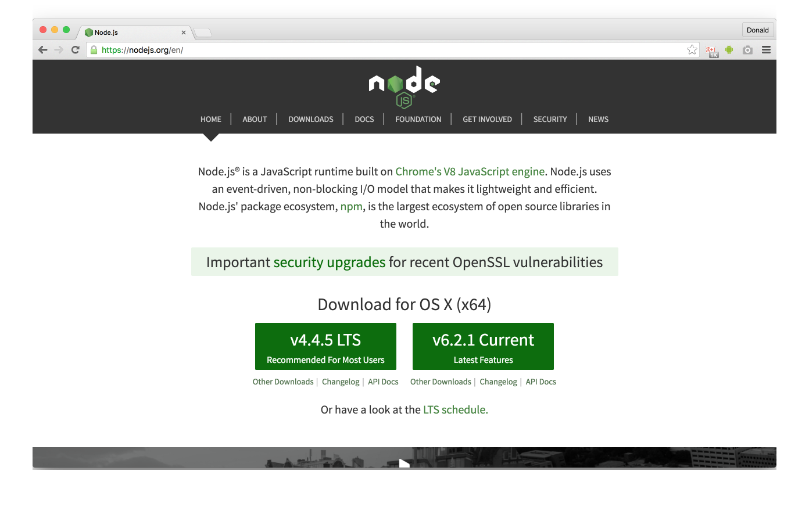
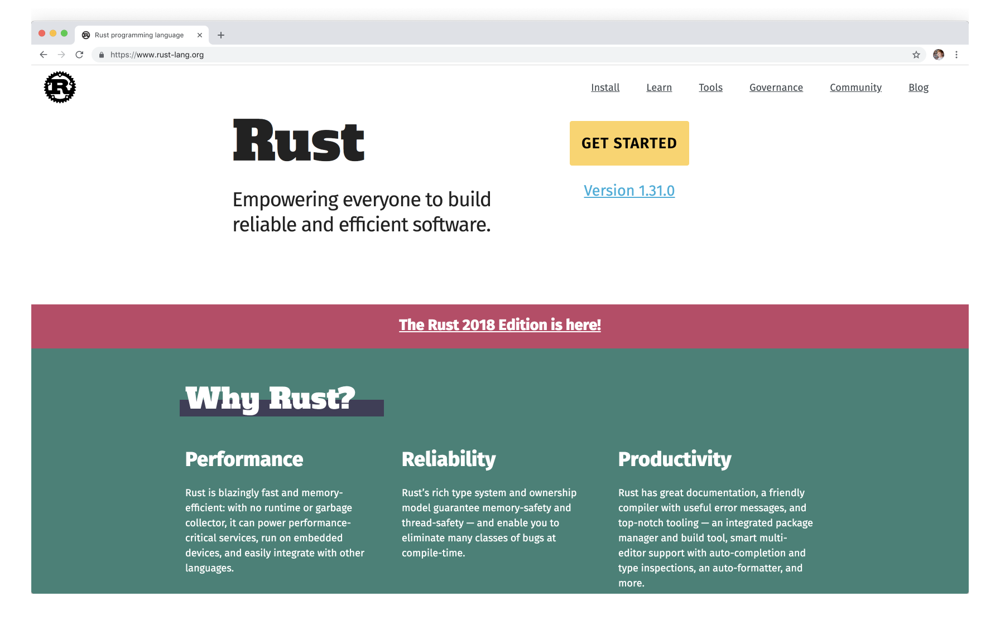
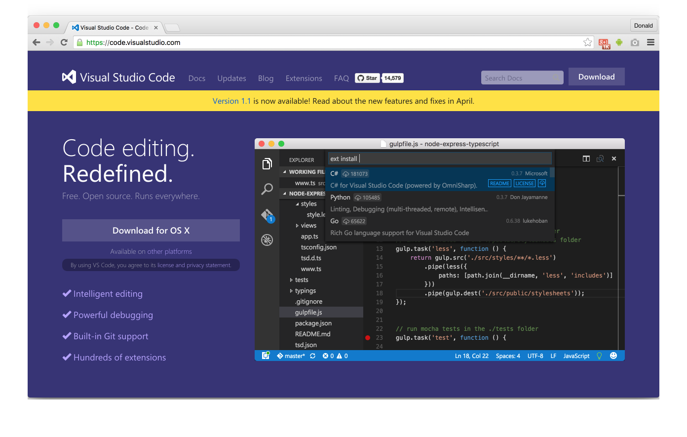
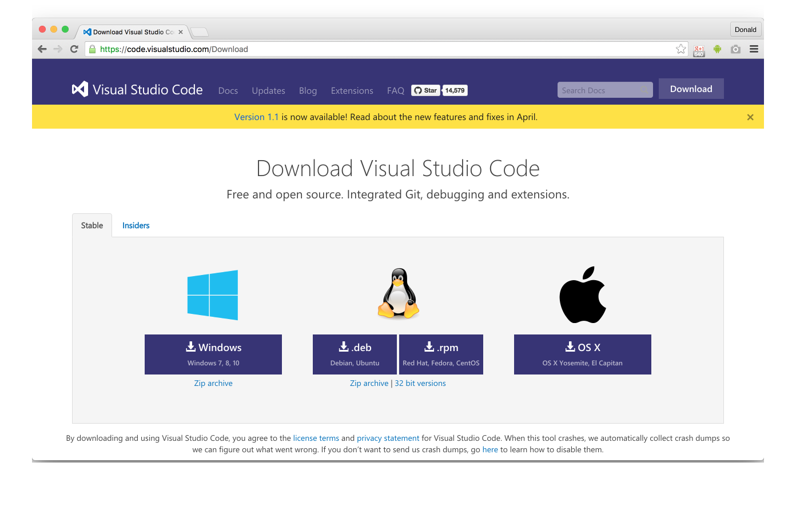

# Setup

## Install Node and Rust

I use Mac OS X 10.11 to write my examples. You probably have Node installed already, but just so we are on the same page we'll do it again together. The installation process is really simple. Just visit Nodes official site [nodejs.org](https://nodejs.org/en/) and download the installer for Node. At the time of writing the latest LTS (long time support!) version is [v4.4.5](https://nodejs.org/dist/v4.4.5/node-v4.4.5.pkg) and the latest stable version is [v6.2.1](https://nodejs.org/dist/v6.2.1/node-v6.2.1.pkg). I'll use v4.4.5 as the LTS release is often the lowest common denominator used by most library authors. A SemVer minor release happens about every _two weeks_.



If you write `node --version` in your terminal now you should see `v4.4.5` in your window:

```bash
$ node --version
v4.4.5
```

Rusts installation process is equally simple. Just visit Rusts official site this time on [rust-lang.org](https://www.rust-lang.org/) and click the _Install_ button to download the installer for the last stable release. At the time of writing this is 1.9.0. A SemVer minor release happens about every _six weeks_. Currently there are no LTS releases. (Every minor release was backwards compatible as no major release has happened after 1.0 so far.)



If you write `rustc --version` in your terminal now you should see `rustc 1.9.0 (e4e8b6668 2016-05-18)` in your window:

```bash
$ rustc --version
rustc 1.9.0 (e4e8b6668 2016-05-18)
```

The `c` after `rust` stands for _compiler_.

I'll actually _not_ use Node and Rust this way, but use the setup explained in the next chapter to easily switch between multiple versions of Node and Rust.

## Manage multiple versions of Node and Rust

If you use Node or Rust for more serious work chances are pretty high that you want to upgrade easily to new versions or switch between multiple old or new versions. You can do this for Node with a tool called [`nvm`](https://github.com/creationix/nvm) and for Rust with a tool called [`rustup`](https://github.com/rust-lang-nursery/rustup.rs). (Note: `rustup` is the follow-up project of `multirust`. Don't use `multirust` as it isn't maintained anymore.)

The installation process for both tools is very easy. To download and install `nvm` you just write this in your terminal:

```bash
$ curl -o- https://raw.githubusercontent.com/creationix/nvm/v0.31.1/install.sh | bash
```

After that you need to close and reopen your terminal. Check if the installation was successful with `nvm --version`:

```bash
$ nvm --version
0.31.1
```

You can install a specific Node version with `nvm install` and passing a version like `v6.0.0`:

```bash
$ nvm install v6.0.0
```

This will install `v6.0.0` and switch this version. You can manually switch between versions with `npm use` like this:

```bash
$ nvm use v4.4.5
Now using node v4.4.5 (npm v2.15.5)
```

You probably want to set a default version which will be used everytime you fire up your terminal. You can do this with `nvm alias default` and passing a version:

```bash
$ nvm alias default v4.4.5
default -> v4.4.5
```

If you have Rust already installed - either because you followed the instructions in the previous chapter or because you installed it yourself anytime in the past - you must uninstall it now, so you can use `rustup`. Don't worry! This is easy. Just run this:

```bash
/usr/local/lib/rustlib/uninstall.sh
```

You actually get uninstall instructions for Rust if you try to install `rustup`. Just in case you use a different platform than mine.

To download and install `rustup` you just write this in your terminal:

```bash
curl https://sh.rustup.rs -sSf | sh
```

You'll be prompted with three options after `rustup` was installed:

```bash
1) Proceed with installation (default)
2) Customize installation
3) Cancel installation
```

You can use `1` to install Rust now or `3` to stop here and check the `rustup` help and version (which I did).

You can verify if everything worked with `rustup --version`;

```bash
$ rustup --version
rustup 0.1.12 (c6e430a 2016-05-12)
```

Now you can install a specific Rust version with `rustup install` and passing a version like `1.9.0`:

```bash
$ rustup install 1.9.0
info: syncing channel updates for '1.9.0-x86_64-apple-darwin'
info: downloading component 'rustc'
 39.1 MiB /  39.1 MiB (100 %)   3.0 MiB/s ETA:   0 s
info: downloading component 'rust-std'
 51.3 MiB /  51.3 MiB (100 %)   3.9 MiB/s ETA:   0 s
info: downloading component 'rust-docs'
  5.8 MiB /   5.8 MiB (100 %) 952.5 KiB/s ETA:   0 s
info: downloading component 'cargo'
  2.6 MiB /   2.6 MiB (100 %) 732.3 KiB/s ETA:   0 s
info: installing component 'rustc'
info: installing component 'rust-std'
info: installing component 'rust-docs'
info: installing component 'cargo'

  1.9.0-x86_64-apple-darwin installed - rustc 1.9.0 (e4e8b6668 2016-05-18)
```

This installed version `1.9.0`, but you still need to activate it as your default version:

```bash
$ rustup default 1.9.0
info: using existing install for '1.9.0-x86_64-apple-darwin'
info: default toolchain set to '1.9.0-x86_64-apple-darwin'

  1.9.0-x86_64-apple-darwin unchanged - rustc 1.9.0 (e4e8b6668 2016-05-18)
```

Now you can check the version of Rust like we did in the previous chapter:

```bash
$ rustc --version
rustc 1.9.0 (e4e8b6668 2016-05-18)
```

Note that `rustup` isn't just a version manager for Rust like `nvm` is a version manager for Node. It can do much more than that and enables you things like compiling your code [for other platforms](https://github.com/rust-lang-nursery/rustup.rs#cross-compilation).

## Setup VS Code as your IDE

I used [WebStorm](https://www.jetbrains.com/webstorm/) as my IDE of choice for several years. It offered the best code completion for JavaScript projects, but this only worked thanks to a lot of indexing and analyzing which also made WebStorm quite slow. I followed all web-based editor projects (like [Brackets](http://brackets.io/) and [Atom](https://atom.io/)) very closely to find a lighter and extensible alternative to WebStorm and finally settled on [VS Code](https://code.visualstudio.com/). It has quite nice code completion for JavaScript (if you use JSDocs) and first-class code completion support for TypeScript projects which I use more often these days - thanks to VS Code!

Currently there is no specific Rust IDE from JetBrains, the developers behind WebStorm, or any other _big_ IDE. However most IDEs and editors offer Rust support via plugins and extensions which need a little bit of configuration. This is what we do now!

First install VS Code, if you haven't already. Just visit [code.visualstudio.com](https://code.visualstudio.com/) and download the installer. The _Download_ button is in the upper right corner.



On the following site you can choose between stable and insider releases. The insider releases offer new experimental features. I'll use the stable release which is version 1.1.1 at the time of writing.



Now we will install [Rusty Code](https://github.com/saviorisdead/RustyCode) the Rust extension for VS Code. Just open VS Code, press `⌘P` (Quick Open) and type `ext install RustyCode`. Click on _Rusty Code_.

After that we need to install [Racer](https://github.com/phildawes/racer). This is used by Rusty Code to get code completion for Rust. You can install Racer easily with Rusts package manager called Cargo, which was installed alongside with Rust. I'll introduce you to Cargo in more detail in the chapter about [package manager](../package-manager/README.md). For now you can install Racer with the following command:

```bash
$ cargo install racer
```

Unlike npm the `install` command always installs packages _globally_ (e.g. to `~/.cargo`, if you used `rustup`) and only packages which are used as a command line tool.

You also need [rustfmt](https://github.com/rust-lang-nursery/rustfmt) so Rusty Code can format your Rust code. We'll use Cargo for this, too:

```bash
$ cargo install rustfmt
```

My Racer version is 1.2.9 and my rustfmt version is 0.5.0.

As the last step we actually need the source code of Rust itself so Racer works properly. Just clone it somewhere in your workspace:

```bash
# e.g. $ cd ~/some-workspace
$ git clone https://github.com/rust-lang/rust.git
```

Now add the following lines to your VS Code `settings.json` (available in _User Settings_ `⌘,`):

```json
{

  "rust.rustLangSrcPath": "/Users/foo/some-workspace/rust/src",
  "rust.formatOnSave": true
}
```

Note that `foo` must be your user name. You have to use the full path beginning with `/Users` as `~` doesn't work. `some-workspace` should be the directory where you cloned the Rust source code. We also enable formatting on save which is disabled by default.

Last but not least you'll want to install the [TOML extension](https://marketplace.visualstudio.com/items?itemName=be5invis.toml) for VS Code. `.toml` files serve as the configuration files in Rust projects, much like `.json` is used in the Node world. Just open VS Code, press `⌘P` (Quick Open) and type `ext install toml`. Click on _TOML Language Support_.